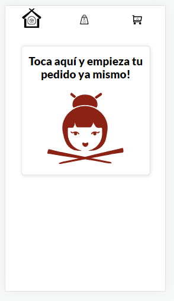

# Restaurant-order placer

## Built With

*Frameworks:
  Front-End:
    -React
    -React Spring
    -React Router
    -React-Redux
  Back- End (Self API rest):
    -Express JS
    -Express-Session
    -Express-MySQL
*API:
    -Self-developed API (Express JS)
    -Google Maps Address autocomplete
    -WhatsApp message API.
*Languages used:
    -HTML5
    -JavaScript
    -SASS
    -SQL
    -EJS
*Other technologies:
  Data-base:
    -MySQL
    -MySQL Workbench
cPanel cloud based database (On Hosting)
  Hosting:
    -cPanel, Godaddy.com
  SSL Certificates:
    -Godaddy.com
  Putty (SSH hosting Linux Access)
 3. Icon Illustrations:
 Adobe Illustrator 2020

To get a local copy up and running follow these simple example steps.
Run:
- `git clone https://github.com/hunter4466/Makit_last.git`
- `cd Makit_last`
-`Install node_modules, run npm install and install 14.17.4 node version (use nvm)`
- Run 'npm run start' from the command line.

## Link

Get a live preview of the project on this link

- Link: [Live-Preview](https://www.makitperu.com/)

## Authors

👤 **Mario Chois**

- Github: [Hunter4466](https://github.com/hunter4466)

## 🤝 Contributing

Contributions, issues, and feature requests are welcome!

Feel free to check the issues page. [issues page](https://github.com/hunter4466/Makit_last/issues).

## Show your support

Give a ⭐️ if you like this project!

## 📝 License

This project is [MIT](./MIT.md) licensed.

